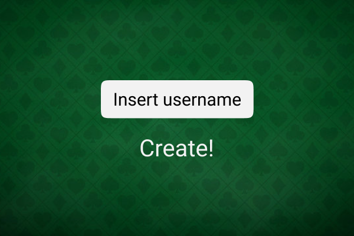
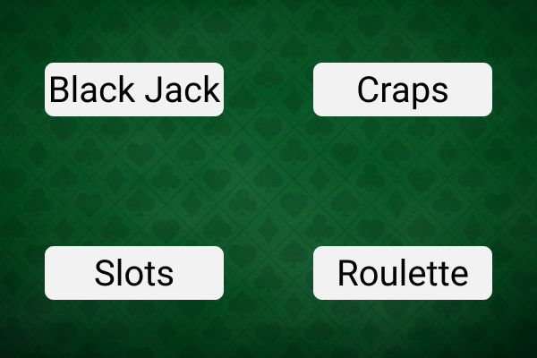
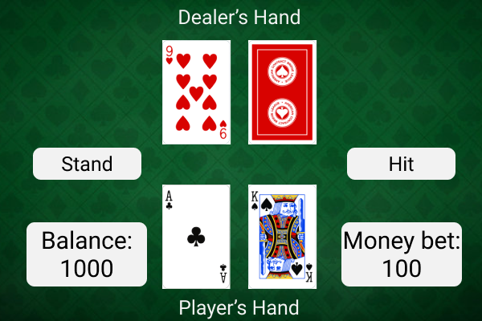
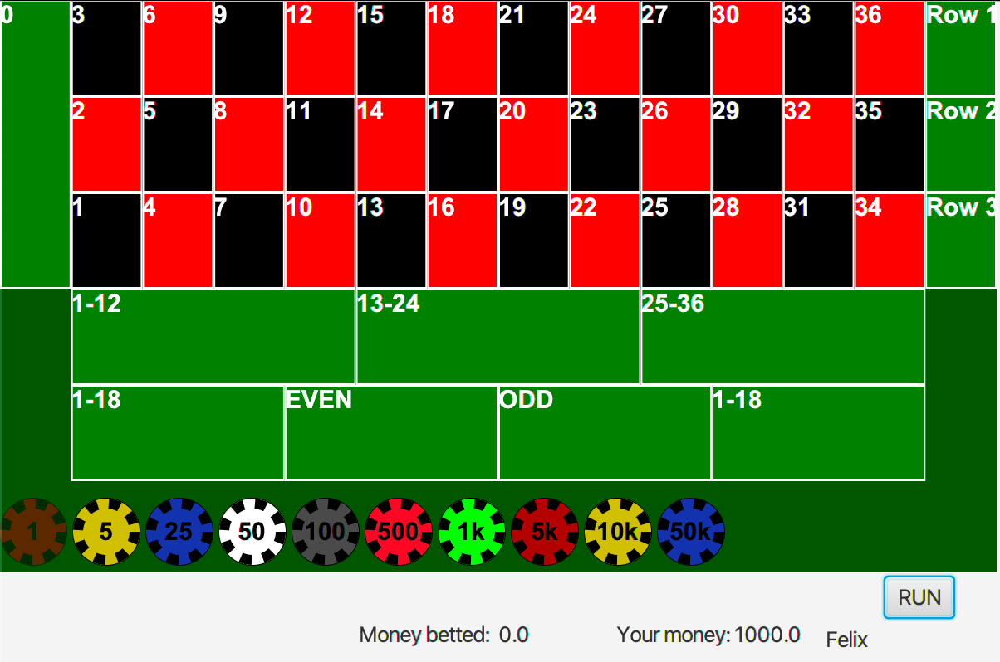

# Casino
The Casino application is meant to serve as an entertainment application for users to play different types of casino games. The users of the application will be able to play blackjack, slots and roulette. The users will also be able to save their profiles with username and balance and load the game in later. 

The code in the application is divided into three main parts, core, ui and storage to easily divide the different parts of the code. The project uses Maven as its building tool. The project also contains tests for testing the different modules. 

## Core
The core module contains all the classes and logic that the application uses to play the different casino games. It is independent of all the UI and filesaving. 

Since our app is a casino, all the logic of how blackjack, roulette and slots are played, happens here in the different packages inside the module. The core module contains classes to handle and represent the logic behind these games.

## UI
All the classes and logic of how the UI and buttons work happens in the UI module.  The UI of our project is to show a start-page where users could either log in or create a new user. Further the user should be able to play different types of casino games like roulette, blackjack and slots. 

The UI is made with JavaFX and FXML, where the FXML files and the controllers of the FXML files are divided in different packages, where the controllers are in the **UI/src/main/java/ui** and the FXML files are in the **main/resources/ui**.

## Storage
The storage module contains all the classes and files for saving (reading and writing to files). Our storage module uses JSON-files for filesaving. (The first release uses textfiles for saving)

## Building with Maven
Since this project is a bigger java application, it is usefull to use a building tool, like Maven or Gradle, to run the tests, check the quality of the code, etc. Our project is configured to use Maven and therefore has a pom.xml file for the configuration: 
The pom.xml file contains different types of information about the project:
- Identefication in the form of **groupId, ArtifactId and version-elements**
- Dependecncies in the form of **Dependecncies-elements**
- Plugins in the form of **Plugin-elements**

Our maven build also has the follwing:
- Setup of Java (**Maven-compiler-plugin**)
- Testing (**Maven-surefire-plugin**)
- The running of JavaFx (**javafx-maven-plugin**)
- Checking the quality of the code with spotbugs (**spotbugs-maven-plugin**)
- Test coverage with jacoco (**jacoco-maven-plugin**)

## Illstrations
Illustrations of what the end product is going to look like:

