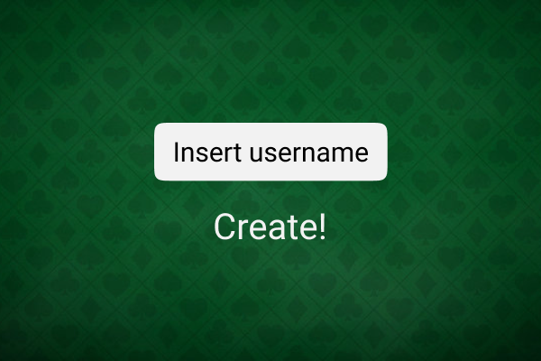
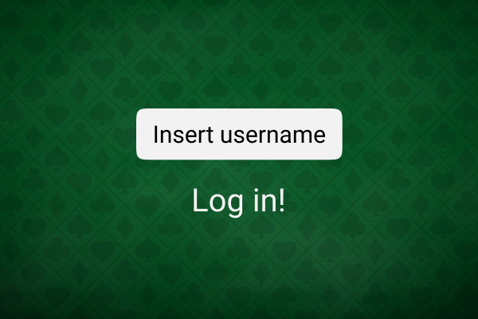
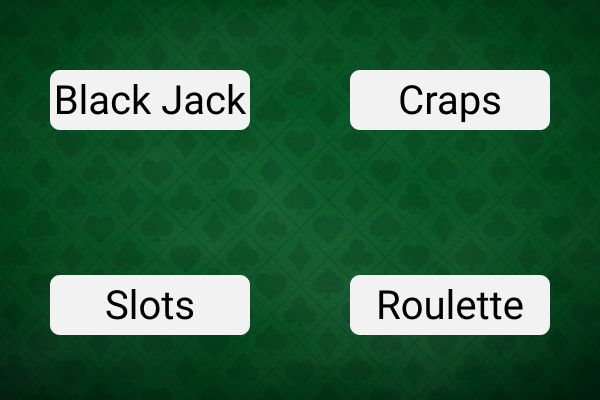
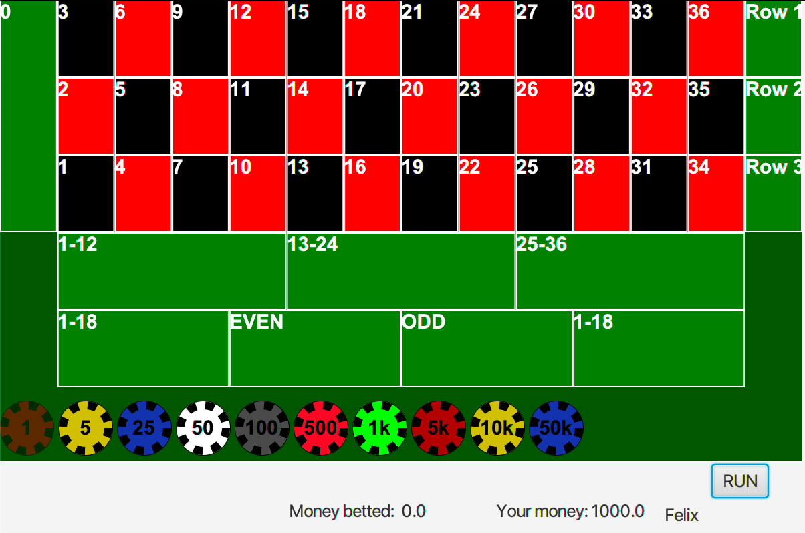

# Documentation for release 1

  

## Maven build

The casino application uses the building tool Maven to build and run the application, the maven build in the project also has the following plugins added:

## GitPod

  
The application can be executed and run with GitPod.  Launch this by pressing the GitPod badge in the root [README.md](https://gitlab.stud.idi.ntnu.no/it1901/groups-2021/gr2124/gr2124/-/blob/main/README.md)

## Running the code:
```powershell
cd casino
```

When inside the casino directory, the next step is to install the project:
```powershell
mvn install
cd ui/
mvn javafx:run
````


## Code architecture

The project is a multi module project to easily divide the different parts of the code. The project is divided in three main modules: Core, UI and Storage. 

### Core
The [core module](https://gitlab.stud.idi.ntnu.no/it1901/groups-2021/gr2124/gr2124/-/tree/main/casino/core) contains all the classes and logic that the application uses to play the different casino games. It is independent of all the UI and filesaving.

Since our app is a casino, all the logic of how blackjack, roulette and slots are played, happens here in the different packages inside the module. The core module contains classes to handle and represent the logic behind these games.

### UI
All the classes and logic of how the UI and buttons work happens in the [UI module](https://gitlab.stud.idi.ntnu.no/it1901/groups-2021/gr2124/gr2124/-/tree/main/casino/ui). The UI of our project is to show a start-page where users could either log in or create a new user. Then the user will be routed to the roulette game with the user used in the log in is the active user. 

The UI is made with JavaFX and FXML, where the FXML files and the controllers of the FXML files are divided in different packages, where the controllers are in the **[UI/src/main/java/ui](https://gitlab.stud.idi.ntnu.no/it1901/groups-2021/gr2124/gr2124/-/tree/main/casino/ui/src/main/java/ui)** and the FXML files are in the **[UI/src/main/java/resources/ui](https://gitlab.stud.idi.ntnu.no/it1901/groups-2021/gr2124/gr2124/-/tree/main/casino/ui/src/main/resources/ui)**.

### Storage 

The storage module contains all the classes and files for saving (reading and writing to files). This first release uses textfiles for saving and reading from files. The storage module is dependent on the core as it uses the User class in core to save the user. 


  

# Workflow

For ensuring a steady and good workflow the group of developers have used the framework scrum with milestones and issues.

  

## Milestones

The group uses milestones for monitoring the sprints throughout the project. The milestone for the first release is called **First group assignment**. 
The sprints will have the duration 1-2 weeks, this depends on the size of the milestone. 

  

## Issues

Throughout the project the group uses issues to easily delegate tasks to other developers working on the project. The issues was made with labels, a due date and an assignee. 
The issues would also have a description that would explain what needs to be done in the issue. For bigger issues there would also be checkboxes for the developers to check if a part of the issue was finished. 

When commiting a new feature, in the commit message the developers would use the # every issue has to link to the issue they have been working on or finished. This ensures that the when a commit happens the other developers could see what issue it belongs to. 

### Labels
All of the issues that was created in the first release has a label to mark what kind of issue or task this is. The main labels that was used was: 
- Cleaning
- us-1 (user-story 1) 
- Documentation
- Infrastructure


### Boards
The board functionality was used to place the issues in three different areas:
- To-do 
- Doing
- Done

This was used so that the developers could easily get an understanding of what is going on in the project. 

## Branch
  
  When working on new features in the application it was very important that the developers would make new branches for that specific feature. The branch should have an appropriate and informative name to let the other developers know what the intention of the branch is.  This is done to ensure that the **main** branch would always work.

### Merge-request

Before merge-requesting the developer of the branch had to inform the other developers in the group that he would be performing a merge-request. The requirement for performing the merge-request would be that the branch is running and would be an appropriate addition to the main branch. 


## Code quality

For ensuring good code quality throughout the project, the following plugins was added to help:

-  Test coverage with Jacoco (**jacoco-maven-plugin**)
Jacoco is a maven-plugin that collects and presents the information of the codecoverage in the code. 

- Checking the quality of the code with spotbugs (**spotbugs-maven-plugin**)
Spotbugs is another maven-plugin that analyses the code for regular bugs.

Both of these plugins run when using the **maven-verify lifecycle.** 

### Tests
Simple tests was added to check that the methods, logic and features in the project worked as intended.  

## Illustrations
Illustrations of what the end product is going to look like:







